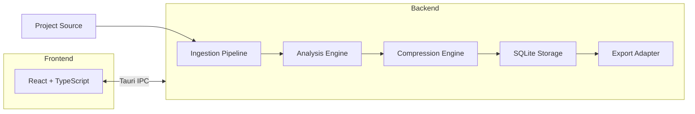

# ContextHub

**AI 项目上下文管理桌面应用** — 导入项目源码，智能分析与压缩，一键导出适配 Claude / Gemini / Cursor 等 AI 编码工具的结构化上下文文件。

[](https://v2.tauri.app/)
[](https://react.dev/)
[](https://www.typescriptlang.org/)
[](https://www.rust-lang.org/)
[](./LICENSE)

---

## Screenshot

> **应用界面预览**：ContextHub 采用深色主题的侧边栏布局。左侧为项目列表导航，右侧为主内容区，依次展示项目导入、文件树浏览、分析结果、压缩预览与格式导出等核心功能面板。


---

## Features

- 📂 **多源项目导入** — 支持本地文件夹、GitHub 仓库一键导入，自动识别 `.gitignore` 过滤无关文件
- 🔍 **双层智能分析** — Tree-sitter 本地规则分析 + LLM 深度精炼，即使无 LLM 配置也能生成基础分析
- 🗜️ **三级上下文压缩** — Minimal (~5%) / Standard (~15%) / Detailed (~30%)，适配不同 AI 工具的上下文窗口
- 📤 **四种导出格式** — Claude (`CLAUDE.md`) / Gemini (`GEMINI.md`) / Cursor (`.cursorrules`) / 通用 Markdown (`context.md`)
- 🔑 **安全密钥管理** — API Key 通过操作系统 Keyring 存储，绝不落盘明文
- 📊 **版本化分析记录** — 每次分析自动递增版本号，支持历史对比
- 🖥️ **原生桌面体验** — 基于 Tauri v2 构建，轻量、快速、跨平台

---

## Architecture



**核心数据流**：严格单向流水线架构

```
Project Source → Ingestion → Analysis → Compression → SQLite → Export
```

| 层级 | 职责 | 技术 |
|------|------|------|
| Frontend | 展示与交互 | React 19 + TypeScript + Tailwind CSS |
| IPC Bridge | 前后端通信 | Tauri v2 IPC |
| Ingestion | 文件遍历与过滤 | walkdir + ignore + git clone |
| Analysis | 代码分析与 LLM 精炼 | Tree-sitter + OpenAI/Claude/Ollama API |
| Compression | 相关性评分与截断 | 自定义 Scorer + Ranker |
| Storage | 持久化存储 | SQLite (rusqlite) |
| Export | 格式化输出 | 4 种专用 Adapter |

---

## Quick Start

### Prerequisites

- [Node.js](https://nodejs.org/) >= 18
- [Rust](https://www.rust-lang.org/tools/install) >= 1.70
- [Tauri CLI](https://v2.tauri.app/start/prerequisites/) 系统依赖

### Install

```bash
# 克隆仓库
git clone https://github.com/your-username/ContextHub.git
cd ContextHub

# 安装前端依赖
npm install

# 安装 Rust 依赖（自动）
cd src-tauri && cargo build && cd ..
```

### Run (Development)

```bash
npm run tauri dev
```

应用窗口将自动打开，前端开发服务器运行在 `http://localhost:1420`。

### Build (Production)

```bash
npm run tauri build
```

构建产物位于 `src-tauri/target/release/bundle/`，macOS 生成 `.dmg`，Windows 生成 `.msi`，Linux 生成 `.deb/.AppImage`。

---

## Tech Stack

| Layer | Technology | Version |
|-------|-----------|---------|
| Desktop Framework | Tauri | v2 |
| Backend Language | Rust | 2021 Edition |
| Database | SQLite (via rusqlite) | 0.31 |
| AST Parsing | Tree-sitter | 0.24 |
| Frontend | React + TypeScript | 19 / 5.8 |
| Styling | Tailwind CSS + shadcn/ui | 4.3 |
| State Management | Zustand | 5.0 |
| Routing | React Router DOM | 7.x |
| LLM Integration | OpenAI / Claude / Ollama APIs | — |
| File Traversal | walkdir + ignore | 2 / 0.4 |
| HTTP Client | reqwest | 0.12 |
| Keyring | keyring | 3 |

---

## Project Structure

```
ContextHub/
├── src/                          # Frontend (React + TypeScript)
│   ├── App.tsx                   # Root app with router
│   ├── main.tsx                  # React entry point
│   ├── components/
│   │   ├── Sidebar.tsx           # Navigation sidebar
│   │   ├── FileTree.tsx          # Project file tree
│   │   └── ui/                   # shadcn/ui components
│   ├── pages/
│   │   ├── Dashboard.tsx         # Project list + import
│   │   ├── ProjectView.tsx       # File tree + analysis + actions
│   │   ├── AnalysisView.tsx      # Analysis results display
│   │   ├── ExportView.tsx        # Format selection + preview + export
│   │   └── Settings.tsx          # LLM config + preferences
│   └── lib/
│       ├── api.ts                # Tauri IPC invoke wrappers
│       ├── store.ts              # Zustand store
│       └── utils.ts              # Utility functions
├── src-tauri/                    # Backend (Rust)
│   ├── Cargo.toml                # Rust dependencies
│   ├── tauri.conf.json           # Tauri configuration
│   ├── migrations/
│   │   └── 001_init.sql          # SQLite schema
│   ├── src/
│   │   ├── main.rs               # Tauri entry point
│   │   ├── lib.rs                # App state & plugin setup
│   │   ├── db/
│   │   │   ├── mod.rs            # Database module
│   │   │   ├── schema.rs         # Schema definitions
│   │   │   └── models.rs         # Data models
│   │   ├── pipeline/
│   │   │   ├── traits.rs         # Core trait definitions
│   │   │   ├── ingestion/        # File import (local, GitHub)
│   │   │   ├── analysis/         # Local rules + LLM refinement
│   │   │   ├── compression/      # Scoring + ranking + levels
│   │   │   └── export/           # Claude, Gemini, Cursor, Markdown
│   │   └── commands/             # Tauri IPC commands
│   └── tests/
│       └── integration_test.rs   # Integration tests
├── package.json
├── vite.config.ts
├── tsconfig.json
└── components.json               # shadcn/ui config
```

---

## Configuration

### LLM Setup

ContextHub 支持三种 LLM 提供商，在 **Settings** 页面配置：

| Provider | Default Endpoint | Default Model |
|----------|-----------------|---------------|
| OpenAI | `https://api.openai.com/v1/chat/completions` | `gpt-4o-mini` |
| Claude | `https://api.anthropic.com/v1/messages` | `claude-sonnet-4-20250514` |
| Ollama | `http://localhost:11434/v1/chat/completions` | `llama3` |

**安全说明**：API Key 通过操作系统原生 Keyring 存储（macOS Keychain / Windows Credential Manager / Linux Secret Service），数据库中不保存明文密钥。

**离线模式**：即使不配置 LLM，ContextHub 仍可通过本地规则（Tree-sitter + 静态分析）生成基础分析结果。

---

## Export Formats

| Format | Output File | Description |
|--------|------------|-------------|
| **Claude** | `CLAUDE.md` | 包含 Overview / Architecture / Key Files / Conventions / Decisions 章节 |
| **Gemini** | `GEMINI.md` | 类似 Claude 格式，附带 HTML 注释标记和元数据摘要 |
| **Cursor** | `.cursorrules` | 规则文件格式，包含 Project Context / Code Style / Architecture / Key Patterns |
| **Markdown** | `context.md` | 通用结构化 Markdown，无工具特定偏好，包含完整元数据 |

### Compression Levels

| Level | Retention | Use Case |
|-------|-----------|----------|
| **Minimal** | ~5% | 快速概览，仅保留最核心文件 |
| **Standard** | ~15% | 日常开发，平衡信息量与上下文窗口 |
| **Detailed** | ~30% | 深度理解，保留更多源码细节 |

---

## Development

### Frontend Development

```bash
# 仅启动前端开发服务器（无 Tauri 后端）
npm run dev
```

### Backend Development

```bash
# 检查 Rust 编译
cd src-tauri && cargo check

# 运行 Rust 测试
cd src-tauri && cargo test
```

### Full Stack Development

```bash
# 启动 Tauri 开发模式（前端 + 后端热重载）
npm run tauri dev
```

### Testing

```bash
# Rust 测试
cd src-tauri && cargo test

# 前端测试
npm run test          # Vitest unit tests
```

---

## License

This project is licensed under the MIT License — see the [LICENSE](./LICENSE) file for details.
